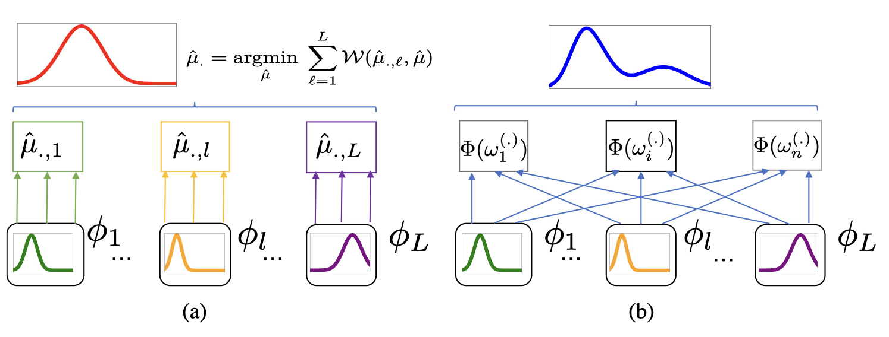

# NLG evaluation via Statistical Measures of Similarity: BaryScore, DepthScore, InfoLM

Automatic Evaluation Metric described in the papers [BaryScore](https://arxiv.org/abs/2108.12463) (EMNLP 2021)
, [DepthScore](https://arxiv.org/abs/2103.12711) (Submitted), [InfoLM](https://arxiv.org/abs/2112.01589) (AAAI 2022).


#### Authors:

* [Pierre Colombo](https://scholar.google.com/citations?user=yPoMt8gAAAAJ&hl=fr)
* [Guillaume Staerman](https://scholar.google.com/citations?user=Zb2ax0wAAAAJ&hl=fr)

## Goal :

This repository deals with automatic evaluation of NLG and addresses the special case of reference based evaluation. The goal is to build a metric m:  where  is the space of sentences. An example is given below:


<div align="center">
<figure>
    
    <div align="center">
<figcaption> Metric examples: similar sentences should have a high score, dissimilar should have a low score according to m. </figcaption>
    </div>
</figure>
</div>


## Overview

We start by giving an overview of the proposed metrics.

### DepthScore (Submitted)

DepthScore is <u>a single layer metric</u> based on pretrained contextualized representations. Similar
to [BertScore](https://arxiv.org/abs/1904.09675), it embeds both the candidate (C: It is freezing this morning) and the
reference (R: The weather is cold today) using a single layer of Bert to obtain discrete probability
measures 
and  . Then, a similarity score is
computed using the pseudo
metric  
introduced [here](https://arxiv.org/abs/2103.12711).


<div align="center">
<figure>
    
    <div align="center">
<figcaption> Depth Score </figcaption>
    </div>
</figure>
</div>


This statistical measure has been tested on Data2text and Summarization.

### BaryScore (EMNLP 2021)

[BaryScore](https://arxiv.org/abs/2108.12463) is  <u>a multi-layers metric</u> based on pretrained contextualized
representations. Similar to [MoverScore](https://arxiv.org/abs/1909.02622),
it aggregates the layers of Bert before computing a similarity score. By modelling the layer output of deep
contextualized embeddings as a probability distribution rather than by a vector embedding; BaryScore aggregates the
different outputs through the Wasserstein space topology. MoverScore (right) leverages the information available in
other layers by aggregating the layers using a [power mean](https://arxiv.org/abs/1803.01400) and then use a Wasserstein
distance ().

<div align="center">
<figure>
    
<figcaption>BaryScore (left) vs MoverScore (right)</figcaption>
</figure>
</div>

This statistical measure has been tested on Data2text, Summarization, Image captioning and NMT.

### InfoLM (AAAI 2022)

[InfoLM](https://arxiv.org/abs/2112.01589) is a metric based on a  <u> pretrained language model (
PLM) </u> (). Given an input sentence S mask
at position i (), the PLM outputs a discret
probability distribution ()
over the vocabulary (). The second key
ingredient of InfoLM is a measure of
information ()
that computes a measure of similarity between the aggregated distributions. Formally, InfoLM involes 3 steps:

* <b>1. Compute individual distributions
  using  for the candidate C and the reference
  R.</b>
* <b>2. Aggregate individual distributions using a weighted sum.</b>
* <b>3. Compute similarity using . </b>

<div align="center">
<figure>
    
<figcaption>InfoLM</figcaption>
</figure>
</div>

InfoLM is flexible as it can adapte to different criteria using different measures of information. This metric has been
tested on Data2text and Summarization.

## References

If you find this repo useful, please cite our papers:

```
@article{infolm_aaai2022,
  title={InfoLM: A New Metric to Evaluate Summarization \& Data2Text Generation},
  author={Colombo, Pierre and Clavel, Chloe and Piantanida, Pablo},
  journal={arXiv preprint arXiv:2112.01589},
  year={2021}
}
```

```
@inproceedings{colombo-etal-2021-automatic,
    title = "Automatic Text Evaluation through the Lens of {W}asserstein Barycenters",
    author = "Colombo, Pierre  and Staerman, Guillaume  and Clavel, Chlo{\'e}  and Piantanida, Pablo",
    booktitle = "Proceedings of the 2021 Conference on Empirical Methods in Natural Language Processing",
    year = "2021",
    pages = "10450--10466"
}
```

```
@article{depth_score,
  title={A pseudo-metric between probability distributions based on depth-trimmed regions},
  author={Staerman, Guillaume and Mozharovskyi, Pavlo and Colombo, Pierre and Cl{\'e}men{\c{c}}on, St{\'e}phan and d'Alch{\'e}-Buc, Florence},
  journal={arXiv preprint arXiv:2103.12711},
  year={2021}
}
```

## Usage

### Python Function

Running our metrics can be computationally intensive (because it relies on pretrained models). Therefore, a GPU is
usually necessary. If you don't have access to a GPU, you can use light pretrained representations such as TinyBERT,
DistilBERT.

We provide example inputs under `<metric_name>.py`. For example for BaryScore

```
metric_call = BaryScoreMetric()

ref = [
        'I like my cakes very much',
        'I hate these cakes!']
hypothesis = ['I like my cakes very much',
                  'I like my cakes very much']

metric_call.prepare_idfs(ref, hypothesis)
final_preds = metric_call.evaluate_batch(ref, hypothesis)
print(final_preds)
```

### Command Line Interface (CLI)

We provide a command line interface (CLI) of BERTScore as well as a python module. For the CLI, you can use it as
follows:

```
export metric=infolm
export measure_to_use=fisher_rao
CUDA_VISIBLE_DEVICES=0 python score_cli.py --ref="samples/refs.txt" --cand="samples/hyps.txt" --metric_name=${metric} --measure_to_use=${measure_to_use}
 ```

See more options by `python score_cli.py -h`.

### Practical Tips

* Unlike BERT, RoBERTa uses GPT2-style tokenizer which creates addition " " tokens when there are multiple spaces
  appearing together. It is recommended to remove addition spaces by `sent = re.sub(r' +', ' ', sent)`
  or `sent = re.sub(r'\s+', ' ', sent)`.
* Using inverse document frequency (idf) on the reference sentences to weigh word importance may correlate better with
  human judgment. However, when the set of reference sentences become too small, the idf score would become
  inaccurate/invalid. To use idf, please set `--idf` when using the CLI tool.
* When you are low on GPU memory, consider setting `batch_size` to a low number.

### Practical Limitation

* Because pretrained representations have learned positional embeddings with max length 512, our scores are undefined
  between sentences longer than 510 (512 after adding \[CLS\] and \[SEP\] tokens)
  . The sentences longer than this will be truncated. Please consider using larger models which can support much longer
  inputs.

## Acknowledgements

Our research was granted access to the HPC resources of IDRIS under the allocation 2021-AP010611665 as well as under the
project 2021-101838 made by GENCI.
